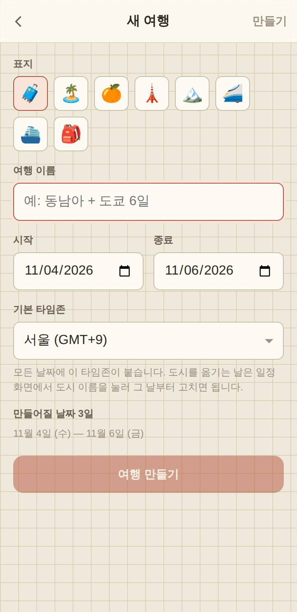
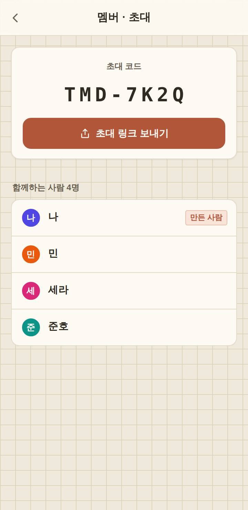
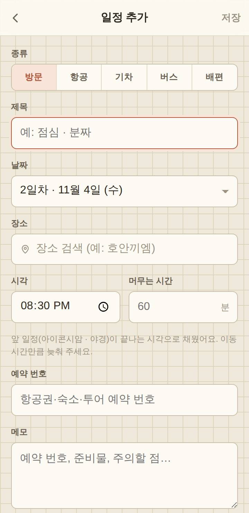
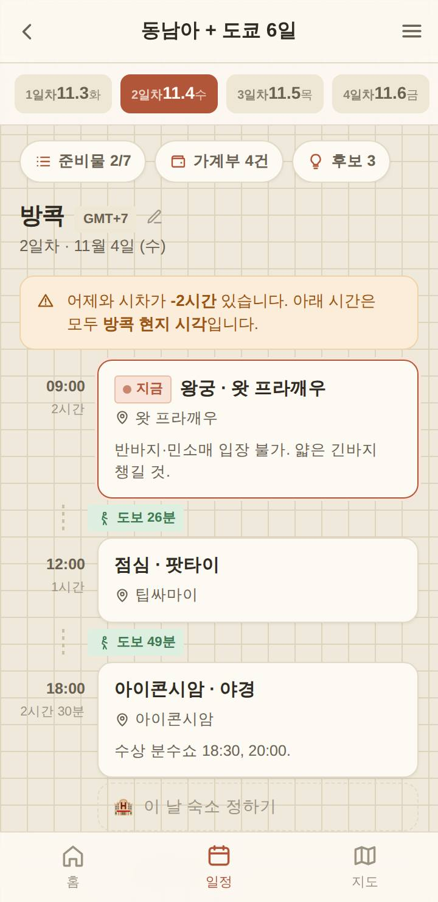
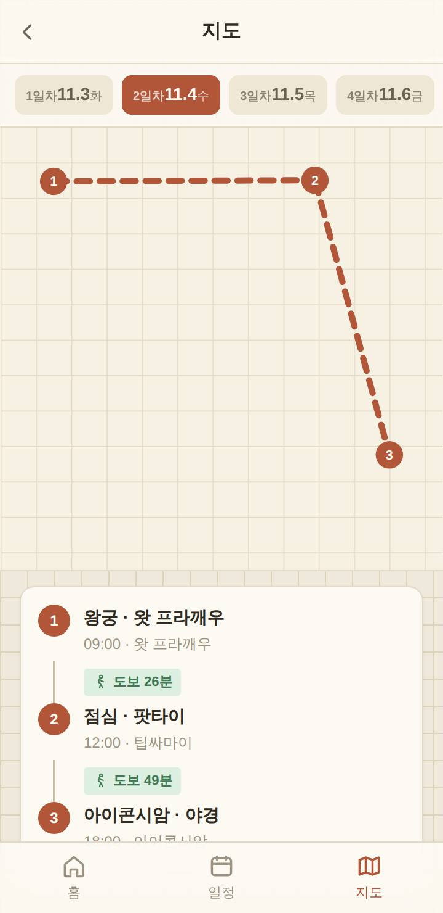
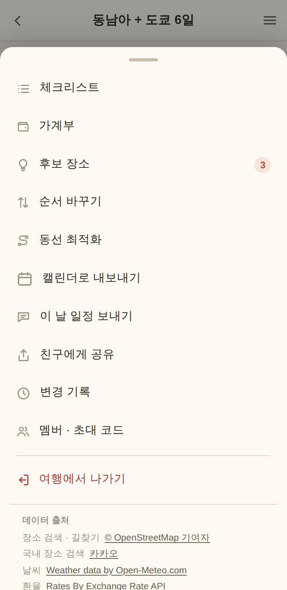
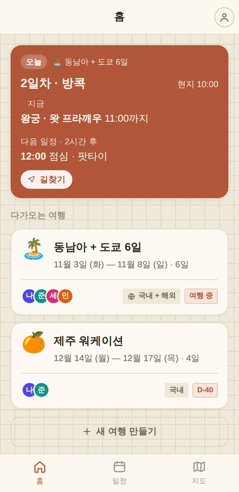

# TravelTomodachi 사용법

> 친구에게 보낼 때는 앱 안의 사용법 페이지 주소를 주면 된다 — 로그인 없이 열리고 한·영·일로 보인다:
> **https://traveltomodachi.pages.dev/#/guide**
>
> 이 문서는 그 페이지의 한국어판이다. 문구를 고치면 `src/i18n/messages/ko.ts`(`guide`)와
> `en.ts`·`ja.ts`도 같이 고친다. 그림은 `node scripts/guide-shots.mjs`로 다시 만든다(파일 맨 위 설명).

친구와 같이 여행 일정을 짜는 앱이에요. 여행을 만들고 친구를 초대하면, 누가 고치든 모두의 화면에 바로 보여요.

- 서비스 주소: https://traveltomodachi.pages.dev
- 로그인: Google 계정. 다른 사람에게 보이는 건 닉네임뿐이에요.

---

## 1. 여행 만들기

홈에서 「새 여행 만들기」를 누르고 이름·날짜·표지를 고르세요. 해외라면 기본 타임존을 그 도시로 — 일정이
현지 시각으로 보여요. 도시를 옮기는 날은 일정 화면에서 도시 이름을 눌러 바꿔요.

## 2. 친구 초대

일정 화면 오른쪽 위 메뉴(≡) → 「멤버 · 초대 코드」에서 초대 링크를 카카오톡으로 보내세요. 친구가 링크를
눌러 로그인하면 바로 같은 여행에 들어와요. 링크를 못 받았으면 홈의 「초대 코드로 참가」에 코드를 넣으면 돼요.

## 3. 일정 넣기

날짜를 고르고 「+ 일정 추가」. 장소를 검색하면 결과가 지도에 번호 핀으로 떠서 어느 지점인지 골라 넣을 수
있어요. 비행기·기차·버스는 종류를 바꿔 출발·도착을 넣어요.

## 4. 하루 일정 보기

일정 사이에 도보·대중교통·차 이동 시간이 자동으로 계산돼요. 구간을 눌러 수단을 바꾸거나 시간을 직접 고칠
수 있어요. 옆으로 밀면 다른 날로 넘어가요.

## 5. 지도로 보기

아래 「지도」 탭에서 그 날 동선을 지도로 봐요. 국내는 카카오맵, 해외는 구글 지도예요. 일정 상세의
「길찾기」를 누르면 지도 앱이 목적지가 찍힌 채로 열려요.

## 6. 같이 쓰는 기능

메뉴(≡)에 가계부(누가 냈는지 적으면 정산까지), 후보 장소(가고 싶은 곳에 투표), 체크리스트(준비물),
변경 기록(누가 무엇을 고쳤는지), 이 날 일정 보내기가 있어요.

## 7. 여행 중에는

여행 기간엔 홈 맨 위에 오늘 카드가 떠요. 지금 할 일, 다음 일정까지 남은 시간, 날씨, 다음 장소로 길찾기가
한 번에 보여요.

---

## 알아 두면 좋은 것

**앱처럼 쓰고 싶어요**
홈 화면에 추가하세요. 아이폰은 사파리 공유 버튼 → 「홈 화면에 추가」, 안드로이드는 크롬 메뉴(⋮) →
「홈 화면에 추가」(또는 「앱 설치」).

**카카오톡에서 링크를 눌렀더니 다른 브라우저가 열려요**
정상이에요. 구글 로그인이 카카오톡 같은 앱 안 브라우저에서는 막혀 있어서 사파리·크롬으로 옮겨 열어요.

**인터넷이 끊기면요?**
한 번 열어 본 여행은 그대로 보여요. 끊긴 동안 고친 것은 기기에 모아 뒀다가 연결되면 보내요.

**돈이 드나요?**
무료이고 광고도 없어요. 다른 사람에게 보이는 건 닉네임뿐이에요.

---

### 그림에 대해

- 개발용 목 데이터(동남아 + 도쿄 여행)로 찍었다. 시계를 여행 2일차 방콕 오전 10시로 맞췄다.
- 지도 그림은 **간략 지도**다 — 찍는 환경에 지도 키가 없어서. 실제 서비스에서는 카카오맵·구글 지도가 뜬다.
- 이동 시간은 찍을 때 직선거리로 만든 가짜 값이다(공개 경로 서버는 매번 답이 달라서).
